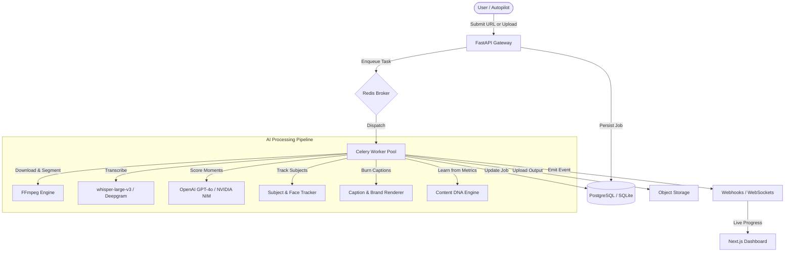

<div align="center">

# 🧠 ClipMind

### Autonomous AI Content Intelligence Platform

*Find your viral moments. Learn what works. Publish on autopilot.*

[]()
[]()
[]()
[]()
[]()
[]()
[]()
[]()


*One command launches the entire stack — API, workers, beat scheduler, and frontend.*

</div>

---

## 📖 Table of Contents

- [The Problem](#-the-problem)
- [How It Works](#-how-it-works-architecture)
- [Key Features](#-key-features)
- [Prerequisites](#-prerequisites)
- [Installation](#-installation)
- [Environment Variables](#-environment-variables)
- [Usage](#-usage-one-command-launch)
- [Project Structure](#-project-structure)
- [Tech Stack](#-tech-stack)
- [Troubleshooting / FAQ](#%EF%B8%8F-troubleshooting--faq)
- [Verification Checklist](#-verification-checklist)
- [Contributing](#-contributing)
- [License](#-license)

---

## 🎯 The Problem

Creators spend hours manually scrubbing footage, guessing which clips will go viral, and juggling five tools to publish a single short. ClipMind solves this end-to-end:

| Pain Point | ClipMind Solution |
| :--- | :--- |
| Manual timestamp hunting | AI-scored extraction finds peak moments automatically |
| Stale selection criteria | Autonomous learning loop refines Content DNA from real engagement |
| Platform-by-platform publishing | Repurpose Engine generates LinkedIn, newsletter, and Shorts in one click |
| Missed trend windows | Proactive spike alerts fire before a clip peaks |

---

## ⚙️ How It Works (Architecture)

ClipMind orchestrates a multi-service pipeline — an API gateway accepts jobs, Redis brokers async tasks to Celery workers, and a chain of AI engines handles everything from transcription to caption rendering.



> **Key insight:** The `Content DNA Engine` closes the feedback loop — it reads real-world engagement metrics back into the scorer, so ClipMind's selection criteria improve over time without any manual tuning.

---

## 🚀 Key Features

### 🤖 Autopilot
Subscribe to YouTube channels or RSS feeds and let ClipMind ingest, score, and queue clips for publishing without any manual intervention. Supports dry-run mode for review before publishing.

### 📊 Clip Intelligence
A continuous performance feedback loop that tracks engagement metrics post-publish and updates your **Content DNA** — the weighted model of what resonates with your specific audience.

### ✂️ Clip Studio
An interactive browser-based timeline editor. Drag segment boundaries, regenerate clips with natural-language prompts (*"find moments where the host laughs"*), and preview renders in real time.

### 📝 Repurpose Engine
From a single processed clip, generate platform-native content variants: LinkedIn thought-leadership posts, email newsletter snippets, and vertical 9:16 shorts — all in one pipeline pass.

### 🎨 Brand Kit
Apply caption templates (Hormozi-style word-by-word, subtitle block, or custom), watermarks, color grading, and intro/outro overlays through a no-code UI.

### 🛡️ Production Resilience
Built to survive pod evictions and database flaps. Features include a **Worker Health Watchdog**, **Atomic Transactional State**, and **Exponential Backoff** for all real-time client connections.

---

## 📋 Prerequisites

Install and verify these before running the setup steps.

| Requirement | Min Version | Purpose | Verify |
| :--- | :---: | :--- | :--- |
| **Python** | 3.10+ | Backend API & Celery workers | `python --version` |
| **Node.js** | 20+ | Next.js frontend | `node --version` |
| **Docker Desktop** *or* **WSL2** | Latest | Auto-starting Redis on Windows | `docker --version` or `wsl --version` |
| **FFmpeg** | 6.0+ | Video cutting, cropping & subtitle burning | `ffmpeg -version` |
| **Git** | Any | Cloning the repository | `git --version` |

> [!WARNING]
> **Windows users:** `run.py` auto-starts Redis via WSL2 or Docker. You need **at least one** of these installed. On macOS/Linux, Redis is started directly via the system package manager or a local binary.

> [!NOTE]
> **FFmpeg on Windows:** Download from [ffmpeg.org](https://ffmpeg.org/download.html), extract, and add the `bin/` folder to your system `PATH`. Restart your terminal afterward.

---

## ⚙️ Installation

**1. Clone the Repository**

```bash
git clone https://github.com/omshah34/clipmind-product.git
cd clipmind-product
```

**2. Install Python Dependencies**

```bash
pip install -r requirements.txt
```

**3. Install Frontend Dependencies**

```bash
cd web && npm install && cd ..
```

**4. Configure Your Environment**

```bash
# Backend environment
cp .env.example .env

# Frontend environment — required for auth to work
cp .env.example web/.env.local
```

Open both files and fill in the required values. See the [Environment Variables](#-environment-variables) table for every key, its purpose, and where to get it.

> [!IMPORTANT]
> `FERNET_KEY` and `NEXTAUTH_SECRET` **must be identical** in both `.env` (backend) and `web/.env.local` (frontend). If these values differ, you will get `401 Forbidden` errors between services. Set them once and copy the same values into both files.

**5. Initialize the Database**

```bash
alembic upgrade head
```

This creates all tables in your local SQLite database (or the PostgreSQL instance defined in `DATABASE_URL`). Run this once on first setup, and again after pulling new migrations from the repo.

**6. Launch**

```bash
python run.py
```

See [Usage](#-usage-one-command-launch) for a full breakdown of what this command does.

---

## 🔑 Environment Variables

> [!IMPORTANT]
> Keys marked **Required** will cause the application to fail on startup if missing. Keys marked **Optional** fall back to sensible defaults but limit functionality.

| Variable | Required | Default | Description | Get It |
| :--- | :---: | :--- | :--- | :--- |
| `OPENAI_API_KEY` | ✅ | — | Core LLM: transcription scoring, clip re-generation, repurpose engine. | [platform.openai.com](https://platform.openai.com/api-keys) |
| `OPENAI_BASE_URL` | ⬜ | OpenAI | Override to route to NVIDIA NIM or OpenRouter for cheaper/faster inference. | [build.nvidia.com](https://build.nvidia.com/) |
| `CLIP_DETECTOR_MODEL` | ⬜ | `gpt-4o` | Model used for moment scoring. Options: `gpt-4o`, `gpt-4o-mini`, `meta/llama-3-70b-instruct`. | — |
| `REDIS_URL` | ✅ | `redis://localhost:6379/0` | Celery task broker. Use default for local dev; swap to Upstash for cloud deployments. | [upstash.com](https://upstash.com/) |
| `DATABASE_URL` | ⬜ | SQLite (local) | PostgreSQL connection string. Leave unset to use local SQLite for development. | [neon.tech](https://neon.tech/) |
| `FERNET_KEY` | ✅ | — | Encrypts API keys and secrets at rest. Must be identical in `.env` and `web/.env.local`. | `python -c "from cryptography.fernet import Fernet; print(Fernet.generate_key().decode())"` |
| `NEXTAUTH_SECRET` | ✅ | — | Secures Next.js session tokens. Must be identical in `.env` and `web/.env.local`. | `openssl rand -base64 32` |
| `NEXTAUTH_URL` | ⬜ | `http://localhost:3000` | Public URL of the frontend. Set this explicitly in production. | — |
| `S3_BUCKET_NAME` | ⬜ | `./outputs` | Object storage bucket for processed clips. Leave unset to store outputs locally. | [aws.amazon.com/s3](https://aws.amazon.com/s3/) |
| `WEBHOOK_SECRET` | ⬜ | — | HMAC secret for validating outbound webhook payloads. | `openssl rand -hex 32` |
| `POSTGRES_POOL_SIZE` | ⬜ | `20` | Max simultaneous DB connections per worker. | — |
| `POSTGRES_MAX_OVERFLOW`| ⬜ | `40` | Burst allowance for DB connections under heavy load. | — |

---

## 🏃 Usage (One-Command Launch)

ClipMind's launcher handles Redis auto-start, environment validation, and service orchestration. You should **never** need to open multiple terminals manually.

```bash
# Start the full stack: API, Celery workers, Beat scheduler, and Next.js frontend
python run.py
```

**Targeted startup flags:**

```bash
python run.py --backend      # API + Workers only (no frontend)
python run.py --frontend     # Next.js UI only (assumes backend is running)
python run.py --no-worker    # API + Frontend, skip Celery workers
python run.py --help         # Full list of flags
```

**What `run.py` does automatically:**

1. Validates that all `Required` env vars are present — fails fast with a clear error if not.
2. Detects your OS and starts Redis via WSL2, Docker, or a local binary.
3. Launches FastAPI via Uvicorn on `http://localhost:8000`.
4. Starts Celery workers with `--pool=solo` on Windows, `--pool=prefork` on Linux/macOS.
5. Starts Celery Beat for scheduled Autopilot tasks.
6. Starts the Next.js dev server on `http://localhost:3000`.
7. **Worker Hot-Reload**: Automatically restarts Celery workers when code changes are detected in `services/` or `workers/` (requires `pip install watchfiles`).

> [!TIP]
> Use `Ctrl+C` once to gracefully stop all services. The launcher registers signal handlers that drain the task queue before shutting down workers.

---

## 📂 Project Structure

```
clipmind-product/
│
├── api/                        # FastAPI application
│   ├── main.py                 # App factory, middleware, startup events
│   └── routes/
│       ├── clips.py            # Clip CRUD, timeline editor endpoints
│       ├── autopilot.py        # RSS/YouTube ingestion & publishing queue
│       ├── repurpose.py        # LinkedIn post & newsletter generation
│       └── webhooks.py         # Outbound event dispatching
│
├── services/                   # Core business logic (no HTTP concerns)
│   ├── clip_detector.py        # LLM-based moment scoring
│   ├── content_dna.py          # Audience learning & preference model
│   ├── performance_engine.py   # Engagement metrics ingestion & feedback
│   ├── repurpose_engine.py     # Multi-format content generation
│   └── brand_kit.py            # Caption templates & overlay rendering
│
├── workers/                    # Celery async task definitions
│   ├── pipeline.py             # Main video processing chain
│   ├── transcription.py        # Whisper / Deepgram integration
│   ├── rendering.py            # FFmpeg caption burn & export
│   └── beat_schedule.py        # Autopilot cron definitions
│
├── db/                         # Data layer
│   ├── models.py               # SQLAlchemy ORM models
│   └── migrations/             # Alembic migration scripts
│
├── web/                        # Next.js 14 frontend
│   ├── app/                    # App Router pages & layouts
│   ├── components/             # Reusable UI components
│   ├── lib/                    # API client, auth config
│   └── .env.local              # Frontend-specific env (gitignored)
│
├── prompts/                    # Versioned LLM prompt templates
│   ├── clip_scorer_v3.txt      # Moment scoring system prompt
│   └── repurpose_linkedin.txt  # LinkedIn post generation prompt
│
├── scripts/                    # Developer utilities
│   └── diagnose_redis.py       # Infrastructure health checker
│
├── docs/                       # Extended documentation
│   ├── IMPLEMENTATION_STATUS.md
│   └── assets/
│
├── run.py                      # ⭐ One-command developer launcher
├── .env.example                # Environment variable template
└── requirements.txt
```

## 🛡️ Resilience & Reliability

ClipMind is built for production stability. Beyond the core features, the platform includes:

### 🐕 Worker Watchdog
An active monitoring task that pings all workers every 120 seconds. It detects "zombie" processes (tasks that have hung without crashing) and terminates them using `SIGKILL` if they exceed 200% of their expected runtime.

### ⚛️ Atomic State Integrity
Clip metadata is stored in a relational `clips` table. All job completions use a **single SQL transaction** to update the job status and write all clip data. If the database flaps mid-write, the job remains in `processing` and is reclaimed by the stale-job detector, ensuring zero partial data corruption.

### 📈 Connection Resilience
- **Database Tuning**: Pre-configured SQLAlchemy connection pooling with 20 persistent connections and 40-slot overflow capacity per worker.
- **WebSocket Jitter**: Reconnection logic uses exponential backoff with random jitter to prevent "thundering herd" server crashes during outages.
- **Stability Reset**: Clients only reset their backoff counters after 10 seconds of stable connection, preventing hammering on flaky networks.

---

## 🛠 Tech Stack

| Layer | Technology | Notes |
| :--- | :--- | :--- |
| **API** | FastAPI + Uvicorn | Native Async Redis split for sync/async stability |
| **Frontend** | Next.js 14 + React Query | App Router, optimized re-renders, zero-flicker theme |
| **State** | React Query | WebSocket-triggered invalidation for 0ms data lag |
| **Auth** | NextAuth.js | JWT sessions + FERNET-encrypted secrets |
| **Task Queue** | Celery 5 + Redis | Includes **Watchdog** for stuck task termination |
| **Database** | PostgreSQL (JSONB) | Atomic relational storage for clips & state integrity |
| **Video Processing** | FFmpeg 6+ | HDR-to-SDR tone mapping & multi-track audio support |
| **Resilience** | Exponential Backoff | Jittered reconnection strategy for 10k+ clients |

---

## 🛠️ Troubleshooting / FAQ

> [!TIP]
> **Run the diagnostic tool first.** Most infrastructure issues are caught automatically:
> ```bash
> python scripts/diagnose_redis.py
> ```

---

**❓ Redis won't start on Windows**

`run.py` tries WSL2 first, then Docker. Ensure at least one is installed and running:

```bash
# Check WSL2
wsl --status

# Check Docker
docker ps
```

If neither is available, install WSL2 via `wsl --install` (requires a system restart) or install [Docker Desktop](https://www.docker.com/products/docker-desktop/).

---

**❓ Celery workers crash immediately on Windows**

Windows does not support `fork`-based multiprocessing. ClipMind sets `--pool=solo` automatically via `run.py`. If you are starting workers manually, always include this flag:

```bash
celery -A workers.pipeline worker --pool=solo --loglevel=info
```

---

**❓ "Forbidden" or 401 errors between API and frontend**

`FERNET_KEY` and `NEXTAUTH_SECRET` must be identical in both `.env` (backend root) and `web/.env.local` (frontend). Regenerate and re-copy both values into both files if they have drifted:

```bash
# Generate a new FERNET_KEY
python -c "from cryptography.fernet import Fernet; print(Fernet.generate_key().decode())"

# Generate a new NEXTAUTH_SECRET
openssl rand -base64 32
```

---

**❓ FFmpeg not found**

Verify FFmpeg is on your PATH:

```bash
ffmpeg -version
```

If the command fails, [download FFmpeg](https://ffmpeg.org/download.html), extract it, and add the `bin/` directory to your system `PATH`. On Windows, restart your terminal after editing PATH.

---

**❓ `CLIP_DETECTOR_MODEL` causes silent scoring failures**

Ensure the model string exactly matches your provider's format. For NVIDIA NIM, prefix with `meta/` (e.g., `meta/llama-3-70b-instruct`). For OpenAI, use `gpt-4o` or `gpt-4o-mini`. The default is `gpt-4o` — do not leave this key blank.

---

**❓ Database migration errors on first run**

Run Alembic to initialize or update the schema:

```bash
alembic upgrade head
```

If you see "table already exists" errors, your local database is stale. Delete `clipmind.db` and re-run the command above.

---

## ✅ Verification Checklist

Run through these steps after setup to confirm everything is wired correctly before processing real content.

- [ ] **Launcher check**: `python run.py --help` prints available flags without errors.
- [ ] **Env check**: Every key in `.env.example` has a value in both `.env` and `web/.env.local`. `FERNET_KEY` and `NEXTAUTH_SECRET` are identical across both files.
- [ ] **Database check**: `alembic upgrade head` completes with no errors.
- [ ] **Redis health**: `python scripts/diagnose_redis.py` reports green on broker connectivity.
- [ ] **API health**: `curl http://localhost:8000/health` returns `{"status": "ok"}`.
- [ ] **Frontend loads**: `http://localhost:3000` renders the ClipMind dashboard without auth errors.
- [ ] **Smoke test**: Submit a YouTube URL via the UI and confirm a clip job appears in the queue and reaches `completed` status end-to-end.

---

## 🤝 Contributing

1. **Fork** the repo and create your branch from `main`:
   ```bash
   git checkout -b feature/your-feature-name
   ```
2. Follow the architectural patterns documented in `docs/IMPLEMENTATION_STATUS.md`.
3. Ensure your changes pass a full smoke test (see checklist above).
4. **Submit a Pull Request** with a clear description of what changed and why.

For significant features, open an issue first to discuss the approach before writing code.

---

## 📄 License

Distributed under the **MIT License**. See [`LICENSE`](./LICENSE) for full terms.

---

<div align="center">

*Built for the next generation of creators.*

[⬆ Back to top](#-clipmind)

</div>