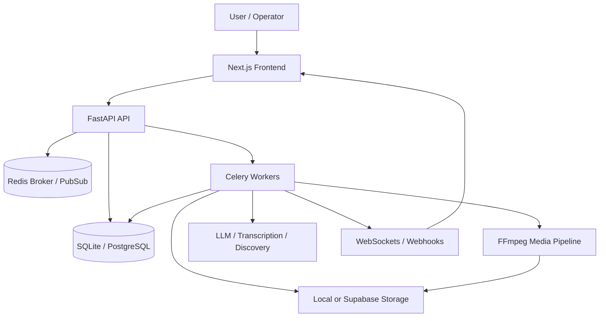

# ClipMind Project Overview Report

## Executive Summary

ClipMind is an autonomous AI content intelligence platform that turns raw video into reusable short-form clips, repurposed content, and publishing-ready assets. The product is built around a pipeline that ingests videos, transcribes and scores them, renders branded outputs, and feeds performance data back into future scoring decisions.

The repository shows a mature full-stack application with:

- A FastAPI backend for jobs, uploads, previewing, publishing, analytics, and workspace management
- Celery workers for asynchronous media processing and scheduled automation
- A Next.js frontend for upload, clip review, preview editing, publish workflows, and dashboards
- Redis for task queuing and realtime event delivery
- SQL-based persistence with SQLite or PostgreSQL support
- FFmpeg-centric media processing and caption rendering

The system is feature-rich, but the repository also contains a large number of documented hardening gaps in `plan.md`. Those gaps are already cataloged in detail and should be treated as the project's active technical debt register.

## What The Product Does

ClipMind is designed to reduce the manual work involved in content repurposing. A user can:

1. Upload a video or ingest a URL
2. Let the pipeline transcribe, score, and split the content into clips
3. Review and adjust clips in a studio-like UI
4. Apply brand styling, captions, and render settings
5. Publish clips to social platforms or generate repurposed text assets
6. Track downstream performance and use it to improve future clip selection

The core differentiator is the feedback loop: ClipMind does not just create clips, it learns from engagement to refine its content DNA over time.

## System Architecture

ClipMind uses a layered architecture with clear separation between HTTP handling, business logic, data access, and background orchestration.

### Main Layers

- `api/` handles request routing, validation, and response shaping
- `services/` contains business logic and integration helpers
- `db/` contains schema setup, connection management, and repository functions
- `workers/` contains Celery tasks and orchestration logic
- `web/` contains the Next.js frontend and reusable UI components
- `docs/` contains implementation summaries, setup notes, and operational references

## Core Product Flows

### 1. Upload and Ingest

The upload path supports:

- Direct browser uploads
- URL-based ingestion
- Background processing through Celery

Relevant pieces:

- `api/routes/upload.py`
- `services/video_downloader.py`
- `services/storage.py`
- `workers/pipeline.py`

### 2. Process and Score

Once a job is created, the worker pipeline typically:

- Downloads or validates source media
- Extracts audio
- Runs transcription
- Detects clip candidates
- Scores clips
- Builds render recipes
- Exports results and updates job state

Relevant pieces:

- `workers/pipeline.py`
- `services/transcription.py`
- `services/clip_detector.py`
- `services/audio_engine.py`
- `services/render_recipe.py`
- `services/video_processor.py`

### 3. Preview and Edit

The preview workflow provides in-browser caption editing and render tracking.

Relevant pieces:

- `api/routes/preview_studio.py`
- `web/app/preview/preview-content.tsx`
- `web/components/clip-timeline-editor.tsx`
- `web/components/clip-player.tsx`

### 4. Publish and Repurpose

The publish surface produces social posts and platform-ready outputs.

Relevant pieces:

- `api/routes/publish.py`
- `api/routes/social_publish.py`
- `services/publishing_service.py`
- `services/export_engine.py`

### 5. Learn from Performance

Performance analytics are used to update the platform's internal scoring model.

Relevant pieces:

- `api/routes/performance.py`
- `api/routes/analytics.py`
- `services/performance_engine.py`
- `services/content_dna.py`
- `workers/analytics.py`

## Key Backend Modules

### `api/`

The API is the orchestration layer for client-facing operations.

Important route groups:

- `jobs.py` for status, clip retrieval, cancellation, deletion
- `upload.py` for direct and URL ingestion
- `clip_studio.py` for preview and clip adjustments
- `preview_studio.py` for render previews and render jobs
- `publish.py` and `social_publish.py` for publishing flows
- `campaigns.py` for campaign grouping and scheduling
- `workspaces.py` for team and client collaboration
- `performance.py` and `analytics.py` for metrics
- `websockets.py` for realtime job progress

### `services/`

This is where the product's real logic lives.

Notable services:

- `video_processor.py` for FFmpeg cut, crop, render, and subtitle operations
- `transcription.py` for Whisper/Groq-backed transcription
- `discovery.py` for semantic search and embeddings
- `content_dna.py` for personalization and feedback weighting
- `publishing_service.py` for queueing and platform publishing
- `storage.py` for local and Supabase storage integration
- `ws_manager.py` for websocket event fanout and history
- `render_recipe.py` for clip render intent and overrides
- `brand_kit_renderer.py` for style-to-render bridging

### `db/`

The database layer combines setup scripts and repositories.

Primary responsibilities:

- Database connection management
- Schema initialization and migration scripts
- Repository-style CRUD for jobs, clips, campaigns, workspaces, performance, and integrations

### `workers/`

Celery workers coordinate asynchronous execution and scheduled jobs.

Key tasks include:

- Pipeline processing
- Clip regeneration
- Sequence analysis
- Analytics sync
- Webhook delivery
- Maintenance and cleanup jobs
- Publishing tasks

### `web/`

The frontend is a Next.js application with dashboard-style views for:

- Uploading media
- Monitoring job progress
- Editing clip boundaries
- Previewing renders
- Publishing clips
- Viewing analytics
- Managing campaigns and workspaces

## Data And Infrastructure

ClipMind can run in a local development mode or against external services.

### Storage

- Local filesystem storage for development and fallback mode
- Supabase storage support for uploaded and rendered media

### Queueing And Realtime

- Redis is used as the Celery broker
- Redis Pub/Sub and buffered history are used for job progress updates

### Database

- SQLite appears to be used for local development
- PostgreSQL support is present for production-style use
- The repository contains migration scripts and Alembic files

### Media Processing

- FFmpeg is a central dependency
- The pipeline supports clipping, cropping, subtitle burning, waveform generation, and proxy media creation

### AI And External Providers

- OpenAI-compatible integrations for transcription and reasoning
- Groq/OpenAI usage appears in transcription and document parsing paths
- Embedding-based discovery is implemented through a local index

## Product Capabilities

### Strengths

- End-to-end video ingestion and clip generation
- Brand kit support for caption styling
- Realtime job status and previewing
- Repurposing into multiple content formats
- Performance feedback loop for smarter future recommendations
- Workspace and campaign structures for multi-project usage

### Operational Strengths

- Explicit worker orchestration
- Signal-based cleanup and shutdown handling
- Realtime websocket delivery with buffered history
- Transactional job and state handling in several routes
- Strong separation between routes, services, and repositories

## Current Implementation Status

The repository suggests a product that is functionally broad and actively hardened, but still under continuous technical debt reduction.

Evidence from the repo:

- `README.md` describes ClipMind as active and production-hardened
- `docs/IMPLEMENTATION_STATUS.md` and `docs/README_STRATEGIC_IMPLEMENTATION.md` show completed major feature work
- `plan.md` tracks a large number of remaining gaps and historical fixes

Practical interpretation:

- The core product flows exist
- Several surfaces are production-ready
- The system still has many documented edge cases, stubs, and cleanup items

## Notable Risk Areas

These are the areas that deserve continued attention:

- Media processing and FFmpeg edge cases
- Upload verification and storage integrity
- Realtime websocket behavior and reconnect logic
- Publish workflow consistency and idempotency
- Analytics and performance contract stability
- Worker deadlocks, retries, and cancellation propagation
- Frontend assumptions around sparse or malformed data

The repository's `plan.md` is effectively the active risk register and should be maintained alongside code changes.

## Representative File Map

### Backend

- `api/main.py`
- `api/routes/jobs.py`
- `api/routes/upload.py`
- `api/routes/clip_studio.py`
- `api/routes/preview_studio.py`
- `api/routes/publish.py`
- `api/routes/social_publish.py`
- `api/routes/performance.py`
- `api/routes/analytics.py`
- `services/video_processor.py`
- `services/transcription.py`
- `services/discovery.py`
- `services/publishing_service.py`
- `services/storage.py`
- `workers/pipeline.py`

### Frontend

- `web/app/page.tsx`
- `web/app/preview/preview-content.tsx`
- `web/app/publish/publish-content.tsx`
- `web/components/job-status.tsx`
- `web/components/live-pipeline.tsx`
- `web/components/clip-player.tsx`
- `web/components/clip-timeline-editor.tsx`
- `web/components/performance-charts.tsx`

### Documentation

- `README.md`
- `docs/IMPLEMENTATION_STATUS.md`
- `docs/README_STRATEGIC_IMPLEMENTATION.md`
- `docs/ROUTES_IMPLEMENTATION_SUMMARY.md`
- `docs/WORKERS_IMPLEMENTATION_SUMMARY.md`
- `plan.md`

## Launch Model

The project is designed around a one-command local startup flow:

- `python run.py`

According to the README, this launcher handles:

- Redis startup
- API startup
- Celery worker startup
- Celery beat startup
- Frontend startup

This is a strong sign that the developer experience is intended to be integrated rather than manually stitched together.

## Bottom Line

ClipMind is a full-stack AI media processing product that combines:

- ingestion
- clip generation
- editability
- branding
- publishing
- analytics
- continuous learning

The repository is far beyond a toy prototype. It is a real product with substantial implementation depth, but it also carries a significant backlog of documented robustness, contract, and edge-case fixes. For the next iteration, the highest leverage work is to continue reducing the gaps in `plan.md` while stabilizing the media pipeline, publish contract, and frontend assumptions.
